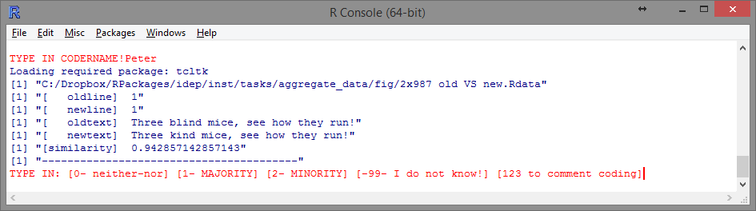
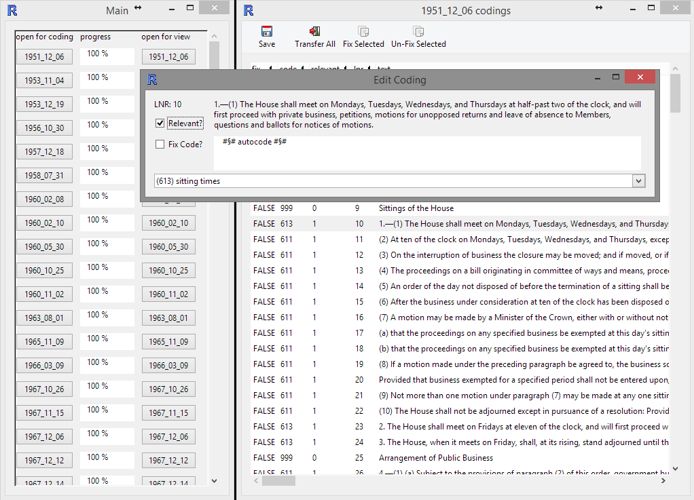

\makeatletter
\newcommand{\justified}{%
  \rightskip\z@skip%
  \leftskip\z@skip}
\makeatother

```{r, include=FALSE}
doc_type <- knitr::opts_knit$get("rmarkdown.pandoc.to")
doc_type
```


```{r, echo=FALSE, results="asis"}
if(doc_type=="latex") cat("\\newpage")
```


# Introduction 

To collect data on reforms of Standing Orders, many steps had to be taken and many hands had to help. The basic idea was that two proceeding versions of the same text can be compared by putting them side by side and going through each (sub)-paragraph. 

```{r, include=FALSE}
library(diffr)
old <- stringr::str_split(
"Three kind mice, see how they run!
They all ran after the farmer's wife,
Who cut off their tails with the carving knife,
Did you ever see such a thing in your life?
As three blind mice.
End", "\n")
new <- 
stringr::str_split(
"Three blind mice, see how they run!
They all ran after the farmer's wife,
they took out some cheese,
and they cut her a slice,
Did you ever see such a sight in your life 
as three kind mice?", "\n")
res <- diffr(old, new, dist="bow")
res_df <- 
  data.frame( 
    lnr1  = res$alignment_df$lnr1, 
    old = paste(substring(res$text1_orig[res$alignment_df$lnr1],1,27),"...") ,
    lnr2  = res$alignment_df$lnr2, 
    new = paste(substring(res$text2_orig[res$alignment_df$lnr2],1,27),"...") ,
    bowdist  = res$alignment_df$distance,
    type  = res$alignment_df$type, 
    stringsAsFactors = FALSE
  )
res_df[is.na(res_df)] <- ""
res_df[res_df=="NA ..."] <- ""
```

```{r, size=1, echo=FALSE}
knitr::kable(
  data.frame(
    lnr1  = 1:6, 
    old   = unlist(old),
    lnr2  = 1:6,
    new   = unlist(new)
  ), 
  align=c("r","l","r","l")
)
```

Some parts might have changed, others might not have changed but were put at different locations. Those parts that have been changed might have been deleted, modified or inserted.

```{r, size=1, echo=FALSE}
knitr::kable(res_df,align=c("r","l","r","l","r","r"))
```


To gather changes in that manner, the first task is to **acquire all the documents** that describe the status or evolution of a particular set of Standing Orders. That step incorporated finding contact persons within the parliaments and checking for completeness and consistency of the provided 'historical' documents. 

While intuitively one might think about Standing Orders as explicit documents that are fully written out, most of the time this is only but a small part of the story. While so called **consolidated versions** exist, most of the time one needs a consolidated version and all the amendments (short, technical instructions of how to transform Standing Orders in place to a new set of Standing Orders) made to that version over time  to know which set of rules was in place at a certain point in time. To apply the basic idea, all amendments had to be transformed into consolidated versions. 

Documents were provided in differing form and in differing shades of quality. There might be sheets of paper, Books, Word-documents, machine readable PDFs or scans. All those various types were first transformed to Word-documents and later on freed of transformation errors and artifacts in a **cleaning** step.

After cleaning and consolidation, **documents were restructured** in such a way that each sub-paragraph corresponded to one line in a plain text file. Furthermore, lines without relevant content such as headlines or notes were marked by `#§#`. The   restructuring made it easy for the documents to be read in by the coding programs used in the following steps. 

For comparing Standing Orders effectively we made use of two types of programs: First, there are programs specialized in presenting the comparison of documents to humans. Second, there are programs that are less accessible by humans, but more standardized and therefore better suited to serve as helpers for computer programs. 
While we found good companions in the first category -- e.g. UltraCompare, the Notepad++ Compare Plugin, DiffDoc, WinMerge, ... see: https://en.wikipedia.org/wiki/Comparison_of_file_comparison_tools, for a list) -- we did not find any tool that suited our needs in the second category -- i.e. indicating line modifications and measuring differences. 

Therefore we wrote our **own software** that helped with comparing texts, assigning change types, and measuring differences. Three programs were written: The first for comparing documents, **gathering links** between sub-paragraph from one version to the other, assigning **change types**, and measuring change; the second for coding changes between documents as **minority or majority friendly**; the third for coding sub-paragraphs into **categories capturing the type of regulation**. 

The data gathered with the help of these programs was then merged into one **database** with three tables: Meta information on the Standing Orders (*texts*), the text of the Standing Orders and accompanied data (*textlines*) and how sub-paragraphs from one version are linked those of another version (*textlines*). Thereafter, the information were **checked for errors**. After elimanting all errors, the raw information from the database was then **aggregated** to various formats.


```{r, echo=FALSE, results="asis"}
if(doc_type=="latex") cat("\\newpage")
```

# Document Transformation

The original Standing Order documents that we gathered often were books or came as scans in PDF format. To be able to further work with them, the text had to be brought into computer readable format. This first digital format of the Standing Orders text was Word. Although, the texts later on were further broken down into plain text, Word is a good intermediate format since everyone is familiar with it and it is able to emulate the layout of the original document which eases comparisons between the original and the digital version. 

```{r, results="asis", echo=FALSE}
if(doc_type=="latex"){
  cat(
"\\begin{center}
\\includegraphics[height=0.7\\textheight]{fig/fig1.png}
\\end{center}"
      )
}else{
  cat("")
}
```

*Figure 1: 1952 German Bundestag Standing Orders word-document*


```{r, echo=FALSE, results="asis"}
if(doc_type=="latex") cat("\\newpage")
```


# Document Consolidation

In order to construct a data base consisting of all parliamentary standing orders that were in force at a specific point in time, consolidated versions of the standing orders were needed. Consolidated versions are complete versions with all changes that had occurred at a specific date included in the body of the text. 

However, there are often only few consolidated versions provided by national parliaments. Changes to the standing orders are most of the time published as amendments and only once in a while a full version of the current text is issued. As a consequence, consolidated versions of the standing orders for every date of change had to be constructed by inserting manually the changes into the previous complete version. 


```{r, results="asis", echo=FALSE}
if(doc_type=="latex"){
    cat(
"\\begin{center}
\\includegraphics[height=0.7\\textheight]{fig/fig1a.png}
\\end{center}"
      )
}else{
  cat("")
}
```

*Figure 2: List of ammendments to the 1950 SO UK, page 497*


```{r, echo=FALSE, results="asis"}
if(doc_type=="latex") cat("\\newpage")
```

# Document Cleaning

The aim of this procedure was to identify and correct errors that had occurred through the process of converting PDF-documents into Word-documents. Another purpose was to put the cleaned versions of the parliamentary standing orders in a standardized format while maintaining the original structure of paragraphs. 
First of all, the oldest consolidated version of Standing Orders was completely read through and corrected manually. Typos, unnecessary line breaks, signs not belonging to the text and everything going beyond the actual text of the Standing Orders was deleted. 

Next, a header containing information about the version such as the dates of acceptance, promulgation and enactment of the version of the standing orders was inserted. The so cleaned version served as our reference version. In the following step, the subsequent consolidated version was compared to the reference version using the software DiffDoc (in a later stage of the cleaning process, the software UltraCompare was used instead). The software made it possible to easily identify identical parts of the two versions that only contained few mistakes to be corrected as well as parts that had been changed. The latter were read completely and handled like the first version. After the cleaning of the second version, it served as the new reference version for the subsequent consolidated version of the Standing Orders. 
Alongside cleaning the text, it was made sure that each sub-paragraph, headline or other structuring element of the standing orders was given a single line. Each element was separated by a line break; no element was allowed to spread more than one line.
The steps were repeated for all consolidated versions. Throughout the procedure, the PDF-versions of the Standing Orders were considered in case of uncertainty regarding cleaning decisions. 
In a last step, the lines (representing text elements) that were of non-relevant content (e.g. headlines) were marked by adding a special string at the start of the line ('#§#') to allow the computer to automatically dismiss these lines later on. 


```{r, results="asis", echo=FALSE}
if(doc_type=="latex"){
    cat(
"\\begin{center}
\\includegraphics[width=\\textwidth]{fig/fig2.png}
\\end{center}"
      )
}else{
  cat("")
}
```
*Figure 3: 1952 SO Germany plain-text version*

```{r, results="asis", echo=FALSE}
if(doc_type=="latex"){
    cat(
"\\begin{center}
\\includegraphics[width=\\textwidth]{fig/fig3a.png}
\\end{center}"
      )
}else{
  cat("")
}
```

*Figure 4: Comparing Standing Orders versions with Ultra Compare*


```{r, echo=FALSE, results="asis"}
if(doc_type=="latex") cat("\\newpage")
```

# Linkage

## Description

Having generated complete, cleaned versions of the Standing Orders, the next step was to further prepare the data so that the content of the Standing Orders could be coded in an efficient manner and to get information about what had or had not been changed from one version to the next. For this purpose, changes in the standing orders between versions were linked. This means that for each line of text (each relevant sub-paragraph) it was recorded whether or not the line was deleted in the subsequent version, got inserted in the current version, got changed or simply stayed the same. 
The coding was done semi-automatically by first letting an algorithm which was developed by the project team and implemented in R handle all non-relevant lines as well as those that were not changed. Thereafter, human coders went through all remaining text lines of two subsequent versions to add linkage information to the data-set. For this purpose, another program implemented in R helped the coders by making sure that: all lines were coded; the information was recorded correctly and alongside the text that was linked, coders were given suggestions for possible matching lines similar to that under consideration. As the linked files constituted the basis for later analyzes and coding, it was crucial to differentiate between minor reformulations of paragraphs (e.g. mere orthographic reforms) and actual changes. In case of doubt the supervisors were consulted. 


The process of gathering link information between sub-paragraphs of subsequent Standing Orders versions allows for distinguishing between types of change (deletion, insertion, modification and no-change), measuring its extent more precisely and to later transfer line codes from one version of the Standing Orders to another, so that all sub-paragraphs (the selected coding entity) that were identical in two versions got automatically the same code. 

Furthermore, the use of an semi-automatic approach allows to use the strengths of both computers and humans: computers are good at doing the same stuff over and over again in the same and predictable way - e.g. finding identical lines, computing measures of similarity, saving data always in the very same format -- while humans on the other hand have a much better understanding of the content of text, might understand intentions of the authors and are more creative and flexible -- e.g. finding line pairs that might be not very similar based on the sequence of characters or the distribution of words, but in regard to the things that are regulated within them.

```{r text comparison with own software, eval=FALSE}
library(stringr)
library(diffr)

# defining text
old <- str_split("Three kind mice, see how they run!\nThey all ran after the farmer's wife,\nWho cut off their tails with the carving knife,\nDid you ever see such a thing in your life?\nAs three blind mice.\nEnd", "\n")
new <- str_split("Three blind mice, see how they run!\nThey all ran after the farmer's wife,\nthey took out some cheese,\nand they cut her a slice,\nDid you ever see such a sight in your life\nas three kind mice?", "\n")

# calculating distances, aligning text, determining change types
res <- diffr(old, new, dist="bow")

# distance matrix
res$distance_matrix

# resulting alignment and change type
res$alignment_df
```
*Code Snippet 1: Text comparison with own software written in R*
 


```{r, results="asis", echo=FALSE}
if(doc_type=="latex"){
  cat(
"\\begin{center}
\\includegraphics[width=\\textwidth]{fig/linkage.png}
\\end{center}"
      )
}else{
  cat("")
}
```

*Figure 5: R Software with commandline interface for linking parts of two version of Standing Orders*


## Training and Quality Control

While software was used to help, finding matches between versions was non-trivial. Coders were recruited on the basis that either they were native speakers or had a very high language proficiency. Good knowledge of the government system of the countries was a further requirement. In addition, coders had to undergo training: 

- First, coders were informed about the purpose of their task, i.e.: Gathering information about changed and unchanged parts of Standing Orders to later on determine the amount of change, as well as easing Corpus Coding and Minority/Majority-Coding. 
- Next, coders were asked to take some time to read the first and the last version available to get a feeling for the content, its structure, and the amount of change that happend between first and last version. 
- Than coders were introduced into DiffDoc and later on UltraCompare to view the whole documents side by side if needed. 
- Than, coders got supervised training on the coding software for one to three reforms. 
- During most of the coding, one of the research assistants was present within the same room to answer questions. Throughout the project, asking questions was explicitly encouraged. 


```{r, echo=FALSE, results="asis"}
if(doc_type=="latex") cat("\\newpage")
```

# Minority-Majority-Change Coding

## Description 

After having identified which parts of the text were modified, moved around, deleted or inserted, those changes could be coded. For this step, the software drew on the information gathered before in the linkage stage to confront the coder only with changes instead of all the text. Coding decisions - pro majority or pro minority - were recorded and added to the database. 


```{r, results="asis", echo=FALSE}
if(doc_type=="latex"){
  cat(
"\\begin{center}
\\includegraphics[width=\\textwidth]{fig/minmaj.png}
\\end{center}"
      )
}else{
  cat("")
}
```

*Figure 6: R Software with commandline interface for coding minority/majority proness of reform*


## Training and Quality Assurance

Coding the proness of changes to the parliamentary Standing Orders towards majority or minority is all but trivial. The original Standing Orders of national parliaments are usually only published in the respective national language. Thus, coders were recruited who were either native speakers or non-native speakers with very high language proficiency. Good knowledge about the government system of the countries was a further requirement. In addition, coders had to undergo an intensive training. 

- First, coders were introduced to the concept of parliamentary minority and majority and how it differs from Government and other political bodies which are often closely connected but might not be the same -- e.g. Governments often are dependent on a parliamentary majority that is supportive or at least tolerates Government, but Government and parliamentary majority  are not the same thing with agendas and personal of their own.
- Next, coders were given one Standing Orders reform with the task to try to code on their own. Coders were asked to be careful and if in doubt to gather argumentations for why a coding  might go in one direction or the other. 
- After having left the coder with this first reform, all coding decisions were discussed. 
- This process usually did not have to be repeated but was done so, if canonical solutions and individual coding decisions were to much apart. 
- After this formal training phase, coders were asked to code all unambiguous neither-nor cases themselves while they should come up with suggestions and reasoning for all ambiguous cases and changes that might be either minority or majority friendly. 
- For most of the time when a coder was working, one of the two research assistants was present in the room. Asking questions was strongly encouraged. 
- After the coder did a batch of coding, all non-clear cases were discussed by the coder and one of the research assistants. If necessary, the project leader was consulted. 


```{r, echo=FALSE, results="asis"}
if(doc_type=="latex") cat("\\newpage")
```

# Corpus Coding

## Description

Based on the linked versions of the standing orders, the content could be coded. The intention of the so called corpus coding process was to assign a single code expressing the content to every legal sub-paragraph of every version of the Standing Orders. 

The coding scheme comprises 80 unique single codes belonging to ten different categories (law-making, special decision procedures other than regular law-making, relationship to government, relationship to external offices/institutions apart from the government, generating publicity, internal organization of parliament, change and interpretation of the Standing Orders, general rules regarding formation and legislative session/discontinuity, final provisions, miscellaneous (cannot be coded otherwise)). 

Apart from the codes, the coding manual encompasses general rules for coding. As every sub-paragraph got only one code, the coders had to decide which code suites best even if several different codes could be assigned to a sub-paragraph. These decisions were based on a specific hierarchy of codes. Rules which concern the interaction of two actors were attributed to the actor which takes the active part if he has discretion regarding this action. Regular law-making was considered more important than other decision procedures if they were treated together in one sub-paragraph. A further general coding rule was to take the overall context into account instead of just looking at a specific regulations. 

Like the other coding processes, corpus coding was done semi-automatically with a self-written program implemented in R. Human coders went through the oldest version of the Standing Orders and assigned the appropriate codes from the coding scheme to every text line to create one fully coded version. The next step was to transfer these codes to the other versions. As in the linking procedure, text lines that have stayed exactly the same from one version to the following had been identified and linked. The R program automatically assigned the same codes to these lines. Thus, the coders only had to go through the not coded text lines of the subsequent version of the Standing Orders (that is the passages that had been changed between two versions) and code them manually. Then, the new codes were transferred. The coders proceeded in this way until all versions of the Standing Orders were completely coded with regard to their content. 

## Training and Quality Assurance 

The original standing orders of national parliaments are usually only published in the respective national language. Thus, coders were recruited who were either native speakers or non-native speakers with very high language proficiency. Good knowledge about the government system of the countries was a further requirement. As corpus coding was a very demanding task, all coders got intensive training. 

- First, coders familiarized themselves with the coding manual, the different categories and coding rules. 
- Next, the new coders practiced through joint coding with experienced coders. 
- After this, the coders coded the most recent version of the Standing Orders and compared their results to a master version. Usually, the most recent versions of the Standing Orders are also issued in English. These versions had been coded by those responsible for the project and served as master versions. 
- On the condition that coders mastered this task, they could start coding on their own. 
- Throughout the coding process, ambiguities and problems were solved in joint discussions with the project coordinators. 
- If necessary, supplementary documents such as constitutions and information from the webpages of the national parliaments were considered to validate coding decisions.


```{r, results="asis", echo=FALSE}
if(doc_type=="latex"){
  cat(
"\\begin{center}
\\includegraphics[width=\\textwidth]{fig/corpus.png}
\\end{center}"
      )
}else{
  cat("")
}
```

*Figure 7: R Software with GUI interface for coding corpus codes*


```{r, echo=FALSE, results="asis"}
if(doc_type=="latex") cat("\\newpage")
```

# Appendix


## Manual for Text Cleansing


**First steps**

-	After Julia assigned you a country, please write your name in the top part of the file "Säuberung_Geschäftsordnungen.xlsx" (Z:/Geschäftsordnungen/Übersichtsdateien/Säuberung_Geschäftsordnungen.xlsx).
-	Complete all dates (Date of Acceptance, Date of Promulgation, Date of Enactment) in this file.
-	As soon as a version is corrected, please highlight this in the file (highlight line in green, put counter from "1"" to "0").
-	To make sure that the original consolidated versions remain unchanged, please copy (DO NOT DRAG AND DROP, BUT ACTUALLY COPY THEM) all consolidated versions to the folder "gesäuberte Versionen" (Z:/Geschäftsordnungen/Daten/CountryName/Gesäuberte Versionen).
-	If this folder does not yet exist, just create it yourself.


**Procedure**

-	First (oldest) consolidated Version
    *	Read it completely and insert/delete the information listed below
    *	Save this cleaned version as a .doc
    *	Use this version as a reference for the following version
-	Other consolidated versions
*	Compare the subsequent consolidated version through DiffDoc with the reference version 
        + Parts that are identical except for mistakes: correct the mistakes in the newer version
        + Parts that have been changed: read these passages completely and clean it like the first version
        + Save this version 
    *	Use this version as a reference for the subsequent version, and so on
-	Note for UltraCompare: Converting the PDF documents to Word documents resulted in so-called "Bedingte Trennstriche" (soft hyphen). These are invisible in the Word documents, but UltraCompare recognizes them. You can delete these by using the "Suchen und Ersetzen" (find and replace) function: at the very bottom, select "Sonderformat" (special format) and then check the option "Bedingter Trennstrich" (soft hyphen). Then, you select the "Replace" option and replace this "Bedingter Trennstrich" with nothing (e.g. not even a space, just leave the line blank).


**Information that should be inserted/deleted**

-	**IMPORTANT: PLEASE DO NOT "CORRECT" THE TEXT WITH REGARDS TO CONTENT – SOME EXPRESSIONS ETC. MAY SEEM ODD, BUT WE ARE ONLY LOOKING TO ELIMINATE ANY MISTAKES THAT CAME INTO EXISTENCE WHEN THE TEXT WAS TRANSFERRED FROM .pdf TO .doc!!!**
-	Delete
    *	Unnecessary line breaks (e.g. if a sentence is intersected by a line break, but the sentence clearly should be in one line) 
    *	all paragraphs and sub-paragraphs should begin in a new line, and there should not be any other line breaks
    *	Typos
    *	Weird signs which do not belong in the text (%, &, $)
    *	Double space characters
    *	Headers and footers
    *	At the beginning of the text: all the stuff before the first headline 
-	Insert/change
    *	At the beginning of the document:
        + Country
        + Title of the Document 
        + Date of Acceptance
        + Date of Promulgation
        + Date of Enactment
    *	Example: 
        + Germany
        + Geschäftsordnung des Bundestages
        + Date of Acceptance: 05.11.1969
        + Date of Promulgation: 10.11.1969 
        + Date of Enactment: (if there is no Date of Enactment, do not write anything after the colon)
    *	Footnotes
        + Replace the numbers of the footnotes in the text by [[FN:NUMBER]], "NUMBER' being a place holder for the number of the footnote
        + Insert the text of the footnote at the end of the paragraph into a new line. This line starts with [[FT:NUMBER]] 'NUMBER' again being a place holder for the number of the footnote
        + Example
            - text text1 text... --> text text [[FN:1]] text ...
            - new line: [[FT:1]] text of the footnote 
        + Save the document like this 
        + In a next step, the footnotes have to be deleted 
        + save this document as well


**Saving the new documents**

-	Word documents
    * Names: Abbreviation of country-Year_Month_Date-cons-sauber-mfn/ofn
        + Months and days always have to be included (use "Date of Enactment")
        + "mfn" stands for "with footnotes", "ofn" stands for "without footnotes"
        + Example: ITA-1999_12_16-cons-sauber-ofn
    * Save the documents to the following location: Geschäftsordnungen/Daten/Länderordner/Gesäuberte Versionen
    * If this folder does not yet exist, create it yourself


**Using Ultra Compare**

-	Open UltraCompare
-	Option for document comparison becomes visible
-	Before loading the documents, do the following
    * Tab "Ansicht": choose "Zeilenumbruch ein"; choose "Zeilenbezug-Modus"
    * Tab "Modus": choose "Textmodus" 
    * Symbol "Sitzungseigenschaften" (this symbol looks like a gearwheel)
        + Tab "Vergleichsoptionen": choose "Beziehungslinien anzeigen" and choose "Wortumbruch"
        + Tab "Ignorieren": choose "leere Zeilen ignorieren" and choose "Weißraum ignorieren"
        + Tab "Spaltenbereiche vergleichen/ignorieren": in the field "Ignorieren", type in "1-4" 
        + this leads to the first four characters being ignored, which is very helpful if the numbering changed. However, you now have to manually check if there are spelling mistakes or the like in the first four characters!
-	Load the documents
-	Start comparison through hitting the green arrow
-	Comparison
    * Black lettering: no change
    * changes
        + <!: line deleted
        + !>: line added
        + *: line changed
        + Red: letter was changed
        + Blue: letter remained the same
-	Corrections can be done directly in UltraCompare, it works like a standard text editor
-	To save the document, select the tab "Datei"
    * select "Speichern Unter" 
    * select correct place and name for saving 
    * hit "Speichern"


```{r, echo=FALSE, results="asis"}
if(doc_type=="latex") cat("\\newpage")
```

## Manual for Linking Standing Orders versions

**Before linking the changes in R**, the following steps have to be taken

1)	Save all cleaned versions as txt-files in "Geschäftsordnungen/Coding Changes/CountryFolder/TXT"
2)	Make sure the naming of the TXT-files complies to the following scheme:
    a.	Country abbreviation 
    b.	minus
    c.	year (4 digits)
    d.	underscore
    e.	month (2 digits)
    f.	underscore
    g.	day (2 digits)
    h.	if and only if there are two versions for the same date indicate them with:
    i.	underscore
    j.	letter (A, B, C, ... for the first, second, ... version on that date, make sure to use CAPITAL Letters)
    k.	Examples: "SWE-2002_09_23.txt", "SWE-2003_01_01_A.txt", 
"SWE-2003_01_01_B.txt", ...
3)	Put #§# (hash paragraph hash space) before all irrelevant lines (e.g. headlines, name of standing orders, date of going into force)


**The intuition behind linking the changes** is as follows:

-	The R-function recognizes automatically when two sub-paragraphs are absolutely identical - if this is the case, they are automatically coded as 100 (% identical)
-	All other sub-paragraphs are presented by the R-function for manual linking (this is even the case if there is just a space too much in either one of the sub-paragraphs)
-	Whether or not two sub-paragraphs belong together can be assessed best when comparing the versions one is linking in UltraCompare

**Linking in R**

1)	Open R
2)	Open Notepad
3)	Execute one of the following functions
    a.	Begin linking: "Coding Changes"
    b.	Continue linking: "Recode Changes"
4)	Comply with the prompts of the function
    a.	Type in your name
    b.	Select the original documents (Geschäftsordnungen/Coding Changes/CountryFolder/TXT/txt-file)
    c.	Press enter
5)	Link non-identical sub-paragraphs (absolutely identical ones are linked automatically)
    - 0: deletion/insertion of a sub-paragraph
    - 1: change of a sub-paragraph
    - 100: sub-paragraph is 100% identical
    - -99: line is irrelevant (this option should have become unnecessary through #§# )
    - -7: show next match
    - 321: correct line number can be inserted directly (useful if the proposed lines do not include the correct line)
    - 666: loop starts again
    - 987: not sure how sub-paragraph should be coded
    - 951: end coding --> every subsequent sub-paragraph will be coded with 987 (if you choose to use this option, write down the last "real" 987 to allow you to continue coding at the right point the next time)

**FAQ**

**Linked as 100% identical (i.e. 100)**

-	When original document says "in the article number 2" and the new version says "in the second article" (and vice versa)
-	When original document says "The commissions are: (and then a list of commissions)", and the new version says "The commissions are the following: (and then a list of commissions)"
-	When original document says "The Parliament", and the new version says "The National Parliament", as long as it is clear they refer the same institution
-	When the difference between original and new version is:
    -	A comma
    -	A space in the middle or end of the sentence
    -	A capital letter
-	When the same article refers to a paragraph that has a different number ("according to article 1" in the original, and "according to the article 2" in the new version), but the content of them is the same

**Linked as change (i.e. 1)**

-	When the same article refers to a paragraph that has a different number ("according to article 1" in the original, and "according to the article 2" in the new version), but the content of these is not the same
-	When the same article refers to the same paragraph that has the same number ("according to article 1" in the original, and "according to article 1" in the new version), but the content of these (article 1) is not the same
-	When the article has changed
-	When part of the original article was deleted (original reads "There are 15 deputies in each commission as minimum, and they cannot exceed 30", and the new version reads "There are 15 deputies in each commission as minimum")
-	When the original document says "according to the President" and the new document says "according to the President of the Parliament" when the first one could also refer the President of a special commission


**ATTENTION:	If in doubt, ALWAYS ask us for help! All of our analyses are based on these linked files!**


```{r, echo=FALSE, results="asis"}
if(doc_type=="latex") cat("\\newpage")
```
## Coding Scheme for Corpus Coding

### Basic Intuition:

Each and every code is exclusive, meaning that one sub-paragraph needs to have one code but one code only. For some codes there are notes on how to decide between multiple codes which may seem appropriate. Sometimes even the coding rules and additional notes will not help to decide between codes. In this case please let us know. Every decision accompanied by doubt should be documented.


### Further rules of the game:

-	Often sub-paragraphs can be coded differently, depending on whether or not one takes into consideration the overall context of the rule or the more specific regulation. If in doubt, code based on the overall context. Example: §14 GOBT: president grants vacation time &#8594; coded as rights and obligations of individual members of parliament if one takes into account the general context (652) and not as responsibility of the president (6212).

-	Rules which concern the interaction of two actors are attributed to the actor which takes the active part if he has discretion regarding this action. Example: §62 (2) GOBT: The plenary can request report of committee &#8594; coded as recall through the plenary (124) and not as report of committee to the plenary (134).

-	The right of those initiating a bill or law to be present at the committee meetings is coded as general right of individual members of parliament (652).


### Scheme

**(1) Law Making**

&nbsp;

*Note: SPs that refer to both the plenary sessions and committees are coded as 12x; SPs dealing with both law-making and special decision procedures are coded as 1xx.*


* **11 Bills and Motions**
    + 111	types of bills and motions; printing and distribution of bills and motions to MPs
    + 112	right to initiate bills and motions 
    + 113	restrictions and deadlines (if not assignable to more specific category, e.g. code 121; 32; 134)
    + 114	legislative planning (concerns the whole term- general schedule)
* **12	Treatment of bills and motions in the plenary** *(Note: SPs including all stages of the treatment of bills and motions are coded as votes in the plenary (123); SPs which determine the subject of debate and vote are coded as subject of vote (123).)*
    + 121	debate in the plenary
    + 122	right of amendment in the plenary 
    + 123	subject of vote, rules of vote (including quorum), voting technology in the plenary
    + 124	the plenary as Committee of the Whole House *(Note: SPs referring to both committees and Committee of the Whole House are coded as committees (not 124 but 13x).)*
    + 125	referral to committee, withdrawal from committee
* **13	Treatment of bills and motions in committee** *(Note: SPs including all stages of the treatment of bills and motions in committee are coded as votes in committee (133); SPs which determine both the subject of debate and the subject of vote are coded as subject of vote in committee (133).)*
    + 131	debate in committee (including hearing) 
    + 132	amendment rights in committee
    + 133	subject of vote, rules of vote (including quorum), voting technology in committee
    + 134	report to the plenary


**(2) Special Decision Procedures other than Regular Law-Making**

&nbsp;

*Note: SPs which concern multiple special decision procedures apart from regular law-making are coded as follows: highest priority is given to constitutional matters, second highest priority is given to financial laws and budgeting, third highest priority is given to EU policy and fourth highest priority is given to foreign policy.*

* **21	constitutional change and amendment**
* **22	financial laws** (money bills) and budgeting
* **23	foreign policy**  (e.g. approval of law of nations, declaration of war *Note: If foreign policy and EU is treated together, the SP is coded as EU (241, 242, 243 or 244).*)
* **24	EU** *(Note: If foreign policy and EU is treated together, the SP is coded as EU (241, 242, 243 or 244))*
    + 241	treatment of EU-bills and motions
    + 242	EU-committee: election and resignation 
    + 243	instructions to the government concerning EU decisions
    + 244	further rights of participation in EU matters (e.g. debates about EU topics not based on EU bills and motions, reaction to violations of subsidiary principle) 
* **25	general rules on elections in parliament** (if not coded as election of government (31), or election of specific officials (411; 421; 441; 6211; 6221; 632))
* **26	further special decision procedures** leading to a decision, e.g. resolution, or leading to a decree/act/bylaw (not mere debate or question time) but cannot be coded as regular law-making nor special decision procedures (21-24)
* **27	procedures concerning laws that are hierarchically situated between regular laws and constitutional laws** (above regular laws; e.g. organic laws in Spain)
* **28 	emergency legislation**
* **29	relationship to sub-national level** (law-making, rights of participation of sub-national level)


**(3)	Relationship to Government**

&nbsp; 

*Note: If vote of no confidence and vote of confidence is treated together, the SP is coded as vote of no confidence (32).*

* **31	election of government / mandatory investiture vote; entry into office**
* **32	vote of no confidence / government resignation**
* **33	vote of confidence**
* **34	instructions to government, involvement of members of government in parliamentary activities** (rights to compel witnesses [usually right of parliament against members of government], right to speak [usually members of government's right], request of information about state of execution of decisions of parliament)


**(4)	Relationship to External Offices/Institutions apart from the Government**

* **41	parliamentary support bodies (e.g. general accounting office, ombudsman,...)**
    + 411	election and resignation
    + 412	competences and resources of external offices/institutions; relations to parliament (e.g. reports, questions, ...)
* **42	head of state**
    + 421	election and resignation
    + 422	relation to parliament (if not coded as law-making (141, 144))
* **43	second chamber (if not coded as law-making (142))**
* **44	constitutional courts**
    + 441	election and resignation
    + 442	relation to parliament (if not coded as law-making (145))
* **45	other external offices**


**(5)	Generating Publicity**

* **51	general rules regarding debate** (e.g. time allotted for speaking, proportional representation of parties during debate, closure of debate)
* **52	debates outside of law-making** (e.g. topical hours ...)
* **53	question rights**
* **54	petitions and petition committee**
* **55	relationship to media and citizens** (e.g. parliamentary TV, accreditation of journalists, publicity of meetings, admissibility of visitors); regulation of matters of confidentiality
* **56	protocols and parliamentary documents; forwarding of documents and decisions to other bodies**


**6	 Internal Organization of Parliament**

* **61	plenary**
    + 611	agenda setting and removal of items from the agenda (general rules which are not specifically regulated under 114)
    + 612	chairing of meetings and measures to uphold order
    + 613	sitting times *(Note: When members are to be present inside the parliament)*
* **62	parliamentary presiding bodies**
    + 621	president of parliament, vice presidents, secretaries and clerks
        * 6211	election, resignation and internal decision rules
        * 6212	responsibilities *(Note: if not coded as more specific category  (e.g. 612), Try to code in regard to the topic at first - 6212 only when no code corresponds)*
    + 622	council of elders or similar coordination body *(Note: The council of elders can be distinguished from the Presidency of Parliament (621) insofar as representatives of the parliamentary party groups are explicitly included.)*
        * 6221	composition, election, resignation, internal decision rules
        * 6222	responsibilities (if not coded as more specific category (e.g. 612))
* **63	committees** (if not coded as more specific category (e.g. 13; 24; 54; 55; 72))
    + 631	general regulations regarding types of committees
    + 632	membership and committee jurisdiction (area of influence-control .g. finance, economy, agriculture...)
    + 633	formal organizational units of committee *(Note: e.g. chair of committee, sub-committees, staff; This is about the appointment and election of the organizational units within committees and NOT about their responsibilities.)*
    + 634	agenda and procedures (details on how decisions are taken) within committees (if not coded as law-making (13))
    + 635	relations to other bodies
        * 6351	relation to plenary (if not coded as 124; 134; 34)
        * 6352 	relation to other committees
    + 636	investigative competencies of regular committees (NOT committees of inquiry (637))
		+ 637	committee of inquiry 
		+ 638	enquête commission
    + 639	other special committees which are not explicitly referenced in this coding manual  *(Note: e.g. oversight committees in Switzerland; Otherwise referenced are: EU-committee (242); committee of inquiry (637); petition committee (54); standing order committee (usually 72); council of elders or similar coordination body (622). Exception: committees which deal exclusively with the confirmation of the elections of members of parliament are coded as 651.)*
* **64	parliamentary party groups**
    + 641	formation of parliamentary party groups
    + 642	rights and obligations of parliamentary party groups (if not coded more specifically as e.g. 112; 51; 52; 53)
    + 643	financial and staff resources
* **65	individual members of parliament**
    + 651	election, entry into office, resignation, incompatibilities, legal status, immunity, indemnity
    + 652	rights and obligations of individual members of parliament (if not coded more specifically as e.g. 112; 51; 52; 53)
    + 653	salary, financial and staff resources
* **66	opposition**
* **67	special bodies for emergency situations**
* **68	parliamentary administration**


**7 	Change and Interpretation of the Standing Orders**

* **71	rules regarding changing the standing orders**
* **72	rules regarding interpretation of and deviation from standing orders**
* **73	debate about standing orders and motions regarding the standing orders**

**8 	General Rules Regarding Formation and Legislative Session; Discontinuity**

**9 	Final Provisions**

**10	Miscellaneous** (cannot be coded otherwise)

**999 	Footnotes and Titles Without Relevant Content**
